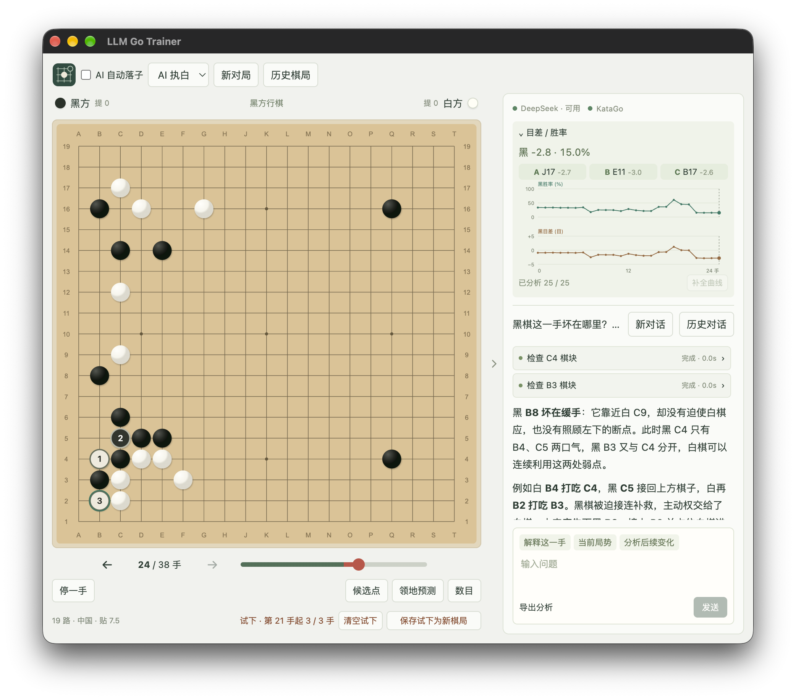

# LLM Go Trainer

[English](README.en.md) · [简体中文](README.md) · [繁體中文](README.zh-TW.md) · [日本語](README.ja.md) · [한국어](README.ko.md)

로컬 [KataGo](https://github.com/lightvector/katago) 대국, 기보 복기, LLM 에이전트 해설을 제공하는 바둑 훈련 앱입니다. macOS와 Windows를 지원합니다.

_하나의 화면에서 기보를 복기하고 변화도를 살펴보며 KataGo 분석과 LLM 해설로 국면을 이해할 수 있습니다._

## 주요 기능

- **AI 대국**: 9·13·19줄 바둑판, 접바둑과 덤 설정, KataGo 및 HumanSL 착수 선택.
- **기보 복기**: SGF 가져오기·내보내기, 대국 기록 저장, 과거 국면에서 시험 진행 후 새 대국으로 저장.
- **국면 분석**: 승률·집 차이 그래프, 후보 수, 주요 변화도, 영역 예측.
- **AI 코치**: DeepSeek API, Codex CLI, Claude Code CLI가 엔진 분석을 바탕으로 착수·국면·변화를 설명.
- **표시 언어**: 영어, 중국어 간체·번체, 일본어, 한국어. 기본값은 시스템 언어입니다.

사용법과 현재 제약은 [사용 안내](docs/ko/usage.md)를 참고하세요.

## 다운로드

[GitHub Releases](https://github.com/junyang-zh/llm-go-trainer/releases)에서 내려받으세요.

| 환경                      | 설치 파일 |
| ------------------------- | --------- |
| Windows 10/11 x64         | `.exe`    |
| macOS 15+ / Apple Silicon | `.dmg`    |

일반판에는 엔진·의존 파일·모델이 포함됩니다. `minimal`은 자동 다운로드하지 않습니다. 오른쪽 위 안내에 따라 왼쪽 위 **설정 → 바둑 모델**에서 **KataGo 다운로드 및 활성화**를 누르세요. 기능은 같습니다. [설치 안내](docs/ko/usage.md#installation)와 [변경 기록](docs/ko/release-notes.md)도 참고하세요.

## 문서

| 문서                                   | 내용                                                     |
| -------------------------------------- | -------------------------------------------------------- |
| [사용 안내](docs/ko/usage.md)          | 설치, 대국, 복기, 시험 진행, 코치, 업데이트              |
| [엔진과 모델](docs/ko/engines.md)      | KataGo 설치, 모델 목록, 백엔드, 사용자 경로, 외부 AI     |
| [LLM 설정](docs/ko/llm.md)             | DeepSeek / Codex / Claude Code, 인증 정보, 코치 프롬프트 |
| [대화형 해설](docs/ko/coach-links.md)  | 좌표 링크, 선택기, 시험 진행 분기                        |
| [개발 안내](docs/ko/development.md)    | Electron, 브라우저 디버깅, 테스트, 번역, 디렉터리        |
| [빌드와 배포](docs/ko/releases.md)     | 패키징, Release, 서명, 공증, 자동 업데이트               |
| [구조와 계획](docs/ko/architecture.md) | 모듈, 스트리밍, 저장, 향후 작업                          |
