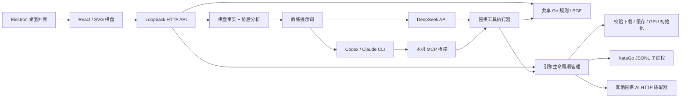

# 架构与后续路线

[English](en/architecture.md) · [简体中文](architecture.md) · [繁體中文](zh-TW/architecture.md) · [日本語](ja/architecture.md) · [한국어](ko/architecture.md)

- `shared/`：棋盘重建、提子、禁着、SGF、面积计分及对手策略；不依赖 UI 或 Node。
- `server/`：参数校验、进程生命周期、分析请求关联、LLM provider 及证据构造。分析请求带完整历史，讲解使用服务端取得的引擎结果。
- `src/`：训练设置、棋盘、主线导航、临时 PV 试读、聊天；棋局、复盘手数、试下分支、对话会话分别管理。棋局和对话通过本地历史库保存，切换棋局或手数不改变会话；localStorage 用于迁移旧棋谱、备份当前棋谱以及语言和搜索偏好。
- `desktop/`：关闭 renderer Node 集成，开启 context isolation / sandbox。后端仅监听 `127.0.0.1` 随机端口，退出时释放 KataGo。
- `prompts/` 与 `skills/`：共用讲棋契约；不重复维护不同的推理视角。

`src/useEvaluations.ts` 串行调度当前局面的后台分析及用户发起的曲线补全，前台任务开始或局面变化时取消旧请求。临时历史按棋盘大小、规则、贴目、初始摆子与完整落子前缀关联，并隔离引擎实例；新棋谱显式清空。只保存每手根节点胜率、目差、visits 和完成状态，完整候选/归属数据只保留当前查询。数值直接使用黑方视角；曲线仅在绘制百分比时将胜率乘 100，目差不反号。缺失手数不连线，未完成结果保留空心点。

Markdown 使用 `react-markdown` + `remark-gfm` 渲染累计公开正文，不启用原始 HTML 或远程图片。外链只接受 HTTP(S)，桌面端交给系统浏览器，不允许模型输出替换应用页面或执行本地协议；受控的围棋 fragment 链接见[交互讲解](coach-links.md)。

`src/i18n.ts` 与五语言词条负责系统语言解析、偏好持久化与不重挂载的界面更新。已知服务通知在渲染时翻译，用户内容与未知诊断保持原文。目差/胜率面板在展开时预留曲线和候选空间，当前数值放在标题行，搜索统计放在已分析进度处。

## 引擎管理

`EngineManager` 默认异步安装并预热 KataGo；界面通过 `/api/status` 读取阶段、下载进度和 PID。启动、停止、重启、切换按队列串行执行；停止会中断下载和预热，等待旧子进程退出再启动新进程。KataGo 使用 `shell:false` / `detached:false` / stdin 管道；退出钩子和 stdin EOF 负责清理，正常关闭最多等待 2 秒后强制结束子进程。源码数据位于 `.local/katago`，桌面归档数据位于 userData。

下载清单固定版本和 SHA-256；临时文件校验后重命名，安装有进程锁和 staging 目录。每次启动复核本地文件。外部适配器与 KataGo 共用 `AnalysisEngine`，返回统一黑方视角；连接方式写入缓存目录的 `connection.json`。详见 [接口与部署](engines.md)。

## 流式协议

`POST /api/analyze` 与 `POST /api/coach` 在 `Accept: application/x-ndjson` 下返回按行 JSON：`status`、`analysis`（before/after，final 区分中间搜索结果）、`tool`（按 ID 更新执行状态与搜索进度）、`text`（累计公开回答）、`done` 或 `error`，教练达到预算时可返回 `paused`。不指定该 Accept 时保留 JSON 响应。

KataGo 开启 `reportDuringSearchEvery`，搜索中的数值只用于即时显示，最终分析才进入讲解证据。DeepSeek 解析 SSE；Claude 解析 `stream_event` 的 `text_delta`；Codex 解析 `item.*` 的 `agent_message`，最终文本以输出文件为准。推理私有内容不进入消息。连接关闭通过 AbortSignal 取消上游；错误和不完整数据流不会被当成成功结果。

## 讲棋 Agent

`server/coach-tools.ts` 提供 `inspect_position`、`analyze_variation`、`query_game_history` 和 `edit_trial`。历史工具支持分页列举棋局、按 ID 读取完整棋谱及指定手数局面，并返回当前原局手数和用户试下状态。每次讲解固定棋谱快照；工具从当前局面或最后一手之前开始，使用 `shared/` 重建和校验试下手顺，再通过同一 `AnalysisEngine` 查询。工具返回棋盘、重点棋块与气、黑方视角分析和候选变化；试下结果通过 `tool` 事件传给对话，不进入主线曲线。完整工具结果随“导出分析”一起导出。

单次讲解的总用时、工具次数与累计搜索量默认无限制，可在 LLM 设置中分别启用上限。每次搜索仍为 50–4,000 visits，默认 800。相同起点、手顺与 visits 的查询复用本次讲解内的缓存。调用串行执行，错误作为工具结果返回给模型修正；取消信号贯穿排队、引擎搜索和 LLM。总时限优先使用 LLM 设置，未保存时使用 `LLM_TIMEOUT_MS`（默认 0，表示无限制）。

DeepSeek 由 `server/deepseek.ts` 驱动多轮调用：拼接流式工具参数、执行工具、回传结果，和其他接入共用工具调用次数额度；达到设置的上限后会暂停并由用户决定是否继续。`reasoning_content` 仅在服务端回传给供应商以延续同一次讲解。

CLI 通过 `server/coach-mcp.ts` 的临时 Streamable HTTP MCP 服务调用同一执行器。服务监听随机 loopback 端口，使用每次请求独立的令牌，校验 Host 与 Origin；令牌通过子进程环境传递。应用通过调用参数配置 MCP，授权这些围棋工具及 [LLM 配置](llm.md) 中说明的供应商网页工具。CLI 退出后关闭 MCP 服务和未完成搜索。执行器回调与 Codex/Claude 的工具事件共同更新 UI，无需修改用户的全局 hook 或 MCP 配置。

## 历史存储

`server/library.ts` 是本地 JSON 文档数据库，每局棋和每个会话使用独立 UUID；临时文件原子重命名后再更新内存索引。`GET /api/library` 读取历史，`POST /api/library/games` 和 `/api/library/conversations` 分别保存。棋谱保存前经 schema 和共享规则验证，损坏的数据库文件会显式报错。桌面默认存放于 `userData/history`，Web 模式默认 `.local/history`，均可通过 `GO_TRAINER_HISTORY_DIR` 覆盖。

`src/useLibrary.ts` 串行保存、合并排队中的同一记录更新，失败时保留待写记录并显示重试入口；读取失败时不会用空历史覆盖旧数据。每轮聊天保存不可变棋局上下文，服务端核对所传局面等于「库内原局前缀 + 试下手顺」，再将上下文交给教练。棋局主线更新只追加实战落子；导入、新局和试下另存均生成新 ID。`shared/trial.ts` 通过共享规则追踪仍在棋盘上的试下棋子，提子后移除标记。

## 数据与权限

开发环境只开放 Vite 5173 与本地服务 3001；服务校验 Host、Origin、JSON 与自定义应用请求头。不开放 CORS、不提供任意命令执行或文件读取接口。CLI 用参数数组启动，棋谱/问题只走 stdin。API key 可以从 UI 写入服务端私有配置文件，或使用环境默认值，任何响应都不回传密钥；API 响应禁用缓存。该服务面向单用户本机，不是多租户公网服务。

`server/llm-settings.ts` 负责认证探测、默认服务选择和原子保存。UI 只接收已脱敏的配置，密钥不进入 localStorage。每次讲棋请求固定服务与配置快照；之后修改设置影响下一次请求。模型、思考深度和服务偏好分别持久化，配置变更使 30 秒的认证探测缓存失效。

棋谱导入不上传。只有提问时，当前棋盘、短历史、候选分析和当前对话才发到所选 LLM。本轮上下文包含棋局标题、ID、原局手数与试下手顺；教练查询历史时可读取该棋谱的元数据和落子。CLI 服务可能根据其账号/供应商策略保存请求；不能把“本地 CLI”当成“离线模型”。

## 首版边界

可以逐手查看和请求讲解，并补全整局的引擎曲线；尚无整局 LLM 自动讲解。SGF 文件作为单个历史条目保存，完整保留变化、注释及图形标记；通过棋谱树浏览并将所选局面打开到主棋盘。主页提供 AI 自动落子开关与 AI 执子选择。手动和 AI 落子共用追加逻辑：主线末尾追加实战落子，历史处或已有试下时继续试下分支，可清空或另存新棋局。历史处的「分支新棋局」将当前局面另存为新局，之后正常落子。PV 仅作临时试读，不污染实战。

数目是用户标死子后的中国面积预览，中国规则映射到 `chinese-ogs`（全局同形禁着），包含让子还点 N；日本正式数目、双活裁定、复杂循环无胜负未完成。难度没有野狐/星阵 Elo 校准；激进度是近似接触偏好。

## 迭代顺序

1. 教学质量：固定证据数据集、人工盲评、实战落点强制搜索、主要变化再分析；完善已有坐标高亮交互。
2. 复盘效率：持久化分析缓存（模型/规则/贴目/历史/profile/visits 联合键）、更细的搜索优先级、逐手目损和关键手索引。
3. 棋谱编辑：完整变体树编辑、保留注释与标记、导入集合、平台样例适配器。
4. 对战：读秒、认输、稳定段位评测、让子策略校准、基于实战的棋风指标。
5. 发布：扩展已有离线打包、签名/公证与自动更新的实机验证，支持系统钥匙串和更新回滚。
