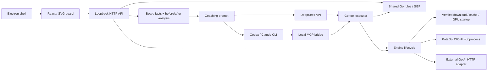

# Architecture and roadmap

[English](architecture.md) · [简体中文](../architecture.md) · [繁體中文](../zh-TW/architecture.md) · [日本語](../ja/architecture.md) · [한국어](../ko/architecture.md)

- `shared/`: board reconstruction, captures, legality, SGF, area scoring and opponent policies; no UI/Node dependency.
- `server/`: validation, process lifecycle, request correlation, providers and evidence. Searches carry full history; explanations use server-obtained engine results.
- `src/`: training, board, main-line navigation, temporary PV preview and chat. Game, review move, trial and conversation are separate states. Local history stores games/conversations; switching games/moves preserves the session. localStorage handles legacy SGF migration/backups and language/search preferences.
- `desktop/`: Node integration off; context isolation/sandbox on. Backend listens only on a random `127.0.0.1` port and releases KataGo on exit.
- `prompts/` / `skills/`: one coaching contract and perspective. UI translations do not duplicate or replace the runtime Chinese prompt.

`src/useEvaluations.ts` serializes background current-position and requested full-graph searches, canceling on foreground work or position changes. Results key on size, rules, komi, setup and full move prefix, with engine isolation; new records reset explicitly. History stores only root win rate, score, visits and completion; full candidates/ownership remain for the current query. All values use Black's perspective: drawing percentages multiplies win rate by 100; score signs never flip. Missing moves create gaps and incomplete points are hollow.

`src/i18n.ts` and five catalogs resolve system language, save explicit preferences and update the UI without remounting. Known service messages are translated at render time; user content/unknown diagnostics remain intact. The expanded evaluation panel reserves graph/candidate space; current values sit in its title, and search statistics accompany analyzed progress.

Markdown uses `react-markdown` / `remark-gfm` for accumulated public text, without raw HTML/remote images. External links accept HTTP(S) only and open in the system browser; model output cannot replace the app page or execute local protocols. Controlled Go fragment links are described in [Interactive coaching](coach-links.md).

## Engine management

`EngineManager` installs/warms up asynchronously. `/api/status` reports phase, progress and PID. Start/stop/restart/switch are serialized; stopping cancels downloads/warmup and waits for the old child before starting another. KataGo uses `shell:false`, `detached:false` and piped stdin. Exit hooks/stdin EOF clean up; normal shutdown force-kills after at most two seconds. Source data uses `.local/katago`, desktop uses userData.

Manifests pin versions/SHA-256. Temporary files verify before rename; installation uses locks/staging. Local files are rechecked each startup. External adapters share `AnalysisEngine` and Black perspective, saving connections to `connection.json`. See [Engines](engines.md).

## Streaming protocol

With `Accept: application/x-ndjson`, `POST /api/analyze` and `/api/coach` emit line-delimited `status`, `analysis` (before/after, `final` distinguishing partial search), `tool` (ID-based activity/progress), `text` (accumulated public answer), `done` or `error`. Coach budgets may emit `paused`. Without this Accept, JSON responses remain supported.

KataGo's `reportDuringSearchEvery` provides live display; only final results become coaching evidence. DeepSeek parses SSE, Claude `stream_event`/`text_delta`, Codex `item.*`/`agent_message`, using its output file as final text. Private reasoning never enters messages. Disconnects propagate AbortSignal; errors/incomplete streams never count as success.

## Coaching agent

`server/coach-tools.ts` implements `inspect_position`, `analyze_variation`, `query_game_history` and `edit_trial`. History supports paginated games, full records by ID and positions by turn, including the original move/trial state. Each explanation fixes a game snapshot. Tools start at the current or pre-last-move position, reconstruct/validate trials using `shared/`, then query the same engine. Results include board facts, groups/liberties, Black-perspective analysis and variations. Tool events populate chat, not the main-line curve; full results accompany evidence export. Trial editing follows the [branch contract](coach-links.md).

Time/tool/total-visit budgets default to unlimited and can be enabled independently. Individual searches remain 50–4,000 visits, default 800. Identical start/sequence/visit queries reuse a per-explanation cache. Calls are serialized; errors return to the model for correction. Cancellation propagates through queues, engine and LLM. Saved timeout takes precedence over `LLM_TIMEOUT_MS` (default 0, unlimited).

`server/deepseek.ts` assembles streamed tool arguments, executes tools and returns results over multiple rounds, sharing budgets with other providers. Limits pause execution for user continuation. `reasoning_content` remains server-side and is returned only to the provider to continue the same explanation.

CLI calls use temporary Streamable HTTP MCP in `server/coach-mcp.ts`, random loopback port and per-request token with Host/Origin validation; the token travels through child environment. Arguments configure MCP and authorize Go tools, plus provider web tools described in [LLM configuration](llm.md). CLI exit closes MCP and searches. Executor callbacks and CLI events update the UI without changing global hooks/MCP settings.

## History storage

`server/library.ts` is a local JSON document database with independent UUIDs for games/sessions. Atomic temporary-file rename precedes in-memory index updates. `GET /api/library` reads history; `POST /api/library/games` and `/api/library/conversations` save records. Schemas/shared rules validate games; corrupt files produce explicit errors. Defaults are desktop `userData/history` and Web `.local/history`, overridable with `GO_TRAINER_HISTORY_DIR`.

`src/useLibrary.ts` serializes saves and merges queued updates to the same record. Failures retain pending writes and show retry; failed reads never overwrite old history with empty data. Each chat turn stores immutable context; the server verifies the position equals the stored game prefix plus trial moves before coaching. Main-line updates only append actual moves. Imports/new games/saved trials get new IDs. `shared/trial.ts` tracks surviving trial stones through shared rules and removes captured markers.

## Data and permissions

Development exposes only Vite 5173/local service 3001. The API checks Host, Origin, JSON and an app header, with no open CORS or arbitrary execution/file-read routes. CLIs launch with argument arrays; boards/questions go through stdin. Keys live in private server config or env, never API responses; responses disable caching. This is a local single-user service, not a public multitenant service.

`server/llm-settings.ts` probes authentication, selects defaults and saves atomically. UI receives redacted settings; keys never enter localStorage. Each coach request fixes a provider/configuration snapshot. Later edits apply to the next request. Model/effort/provider preferences persist; edits invalidate the 30-second availability cache.

SGF import does not upload. Asking sends board, short history, engine candidates and conversation to the chosen LLM. Context includes title, ID, original move and trials; history tools may read metadata/moves. CLI providers may retain requests according to account policies. A local CLI is not an offline model.

## Current limits

Per-move review/coaching and complete engine curves are available; automatic whole-game LLM review is not. SGF files are stored as single history entries with all variations, comments and marks; tree browsing opens a selected position on the main board. Manual/AI moves share logic: append at the main-line end or extend trials at historical positions/existing branches; clear/save trials or fork a historical position as a new game. PV previews never modify played games.

Scoring previews Chinese area after manual dead-stone marking, with `chinese-ogs` positional superko and handicap bonus N. Formal Japanese scoring, seki adjudication and complex cyclic no-results are incomplete. Difficulty lacks Fox/Golaxy Elo calibration; aggression approximates contact preference.

## Future work

1. Teaching quality: fixed evidence datasets, human blind review, forced played-move searches and deeper PV verification; refine coordinate interaction.
2. Review efficiency: persistent caches keyed by model/rules/komi/history/profile/visits, finer priorities, point-loss and key-move indexes.
3. Record editing: complete variation trees, comments/marks, collections and platform adapters.
4. Play: clocks, resignation, calibrated ranks/handicaps and style metrics from actual games.
5. Distribution: broader offline/hardware validation, system keychains and update rollback, building on existing packaging/signing/update support.
