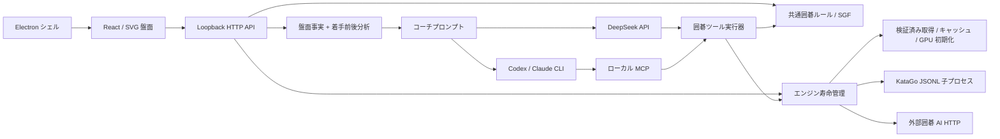

# 設計と今後の計画

[English](../en/architecture.md) · [简体中文](../architecture.md) · [繁體中文](../zh-TW/architecture.md) · [日本語](architecture.md) · [한국어](../ko/architecture.md)

- `shared/`：盤面復元、取り、合法性、SGF、面積計点、相手選択。UI/Node に依存しません。
- `server/`：検証、プロセス寿命、要求の対応付け、LLM、根拠構築。分析は全履歴を渡し、解説はサーバーが得たエンジン結果を使います。
- `src/`：訓練、盤面、本譜移動、一時主変化、会話。対局・手数・試し打ち・会話を別状態で管理し、履歴庫に保存します。対局・手数変更は会話を変えません。localStorage は旧 SGF 移行・バックアップと言語・探索設定に使います。
- `desktop/`：Node integration 無効、context isolation / sandbox 有効。ランダム `127.0.0.1` ポートのみ待ち受け、終了時に KataGo を解放します。
- `prompts/` / `skills/`：同じ解説契約と視点を共有。UI 翻訳で実行時中国語プロンプトを複製・変更しません。

`src/useEvaluations.ts` が現在局面の背景分析とグラフ補完を直列化し、前面処理・局面変更で旧要求を取り消します。結果は盤サイズ・ルール・コミ・初期石・全着手接頭列・エンジンで分離し、新規棋譜は明示リセットします。履歴は根勝率・目差・visits・完了状態だけ、全候補・領域は現在要求だけ保持します。黒視点のまま勝率表示のみ ×100、目差符号は反転しません。欠落は線を結ばず、未完了は中抜き点です。

`src/i18n.ts` と 5 カタログがシステム言語、選択保存、再マウントなしの更新を扱います。既知のサービス通知は描画時に翻訳し、利用者内容・未知の診断は原文です。展開パネルはグラフ・候補領域を確保し、見出しに現在値、分析進捗に探索統計を置きます。

Markdown は `react-markdown` / `remark-gfm` で公開本文を描画し、生 HTML・遠隔画像は無効です。外部リンクは HTTP(S) のみをシステムブラウザーで開き、アプリ画面の置換やローカルプロトコル実行を許しません。囲碁 fragment は[対話型解説](coach-links.md)の制御された契約です。

## エンジン管理

`EngineManager` は導入・初期化を非同期に行い、`/api/status` で段階・進捗・PID を返します。起動・停止・再起動・切り替えを直列化し、停止は取得・初期化を取り消して旧子終了後に次を起動します。KataGo は `shell:false` / `detached:false` / stdin パイプを使い、終了フックと EOF で清掃、通常は最大 2 秒後に強制終了します。ソースは `.local/katago`、デスクトップは userData です。

manifest は版・SHA-256 を固定し、一時ファイルを検証後に改名、ロック・staging で導入します。毎起動時にファイルを確認します。外部 AI も `AnalysisEngine` と黒視点を共有し、接続は `connection.json` に保存します。[エンジン](engines.md)を参照してください。

## ストリーミング

`POST /api/analyze` / `/api/coach` は `Accept: application/x-ndjson` で `status`、`analysis`（before/after、`final` で中間を区別）、`tool`（ID 別の状態・進捗）、`text`（累積公開本文）、`done` / `error` を行単位で返します。コーチ予算時は `paused` も返します。Accept 指定なしの JSON も維持します。

KataGo の `reportDuringSearchEvery` は即時表示用で、最終結果だけが解説の根拠になります。DeepSeek は SSE、Claude は `stream_event` の `text_delta`、Codex は `item.*` の `agent_message` を読み、Codex 最終本文は出力ファイルを基準にします。非公開推論はメッセージに入れません。切断は AbortSignal を伝え、エラー・未完了を成功と扱いません。

## コーチエージェント

`server/coach-tools.ts` は `inspect_position`、`analyze_variation`、`query_game_history`、`edit_trial` を提供します。履歴はページ別一覧・ID の棋譜・指定手数の局面と原局手数・試し打ち状態を返します。解説ごとに棋譜スナップショットを固定し、現在または直前局面から `shared/` で手順を復元・検証し、同じエンジンへ照会します。盤面、連・呼吸点、黒視点分析、候補変化を返し、tool イベントは会話に入り本譜曲線には入りません。全結果は根拠出力に含み、編集は[分岐契約](coach-links.md)に従います。

時間・ツール・累計 visits は既定無制限で個別設定できます。1 探索は 50〜4,000 visits、既定 800。同じ起点・手順・visits は今回の解説内でキャッシュします。直列呼び出しのエラーはモデルへ戻して修正させ、取消は待ち行列・エンジン・LLM に伝播します。保存時限は `LLM_TIMEOUT_MS`（既定 0）より優先します。

`server/deepseek.ts` は流式引数を組み立て、ツール実行・結果返却を繰り返し、他接続と同じ予算を使います。上限で一時停止し利用者が続行できます。`reasoning_content` はサーバー内に留め、同じ解説の継続用にのみサービスへ返します。

CLI は `server/coach-mcp.ts` の一時 Streamable HTTP MCP を使います。ランダム loopback と要求別 token、Host/Origin 検証を使い、token は子環境へ渡します。引数で MCP と囲碁ツール、および [LLM 設定](llm.md) のウェブツールを許可します。CLI 終了で MCP・未完了探索を閉じ、実行器と CLI イベントが UI を更新します。利用者の global hook / MCP 設定は変えません。

## 履歴保存

`server/library.ts` は対局・会話ごとに UUID を持つ JSON 文書 DB です。一時ファイルのアトミック改名後にメモリ索引を更新します。`GET /api/library` で読込、`POST /api/library/games` / `/api/library/conversations` で保存します。棋譜は schema と共有ルールで検証し、破損は明示エラーです。既定は `userData/history` / `.local/history`、`GO_TRAINER_HISTORY_DIR` で変更できます。

`src/useLibrary.ts` は保存を直列化し同一レコードの待機更新を統合、失敗時は未書込を保持し再試行を表示します。読込失敗で空履歴を上書きしません。各会話は不変文脈を保存し、サーバーが「保存棋譜接頭列＋試し打ち」との一致を検証してコーチへ渡します。本譜は実戦手だけ追加し、読み込み・新局・試し打ち保存は新 ID です。`shared/trial.ts` が残存する試し打ち石を追跡し、取られたマーカーを除去します。

## データと権限

開発は Vite 5173・API 3001 のみです。Host、Origin、JSON、専用ヘッダーを検証し、公開 CORS や任意実行・ファイル読込 API は提供しません。CLI は引数配列で起動し、棋譜・質問は stdin のみです。キーはサーバー私有設定または env に保存し、応答には返さずキャッシュも無効にします。単一利用者のローカルサービスであり、公開マルチテナント用ではありません。

`server/llm-settings.ts` は認証確認、既定選択、アトミック保存を扱い、UI には秘匿済み設定のみを渡します。キーは localStorage に入りません。要求ごとにサービス・設定を固定し、変更は次回に適用します。モデル・深さ・選択を保存し、変更は 30 秒キャッシュを無効にします。

SGF 読込はアップロードしません。質問時だけ盤面・短履歴・候補・会話を送ります。文脈にタイトル・ID・原局手数・試し打ちを含み、履歴ツールはメタデータ・着手を読めます。CLI サービスも契約により要求を保持する場合があり、ローカル CLI はオフラインモデルではありません。

## 現在の制約と今後

逐手解説と全局エンジン曲線はありますが、全局自動 LLM 解説はありません。SGF はファイルごとに一つの履歴項目として全分岐・解説・マークを保存し、ツリーから選択した局面をメイン盤面に開けます。手動・AI は共通の追加処理を使い、本譜末尾では実戦、それ以外では試し打ちを続けます。消去・新局保存・過去局面の分岐ができ、PV 試読は実戦を変えません。

中国面積計点は手動死石指定後のプレビューで、`chinese-ogs`（盤面同形反復禁止）、置き石補正 N を使います。日本正式計点、セキ裁定、複雑な循環の無勝負は未完了です。野狐・星陣 Elo 校正はなく、積極性は接触傾向の近似です。

1. 教学：固定根拠データ、人間の盲検評価、実戦手の強制探索、主変化再検証、座標操作の改善。
2. 検討：モデル/ルール/コミ/履歴/profile/visits 別永続キャッシュ、優先度、損失目数・重要手索引。
3. 棋譜：完全な分岐編集、注釈・マーク、集合、プラットフォーム対応。
4. 対局：時計、投了、段級位・置き石校正、実戦由来の棋風指標。
5. 配布：既存のオフライン・署名・更新の実機検証拡大、OS キーチェーン、更新ロールバック。
