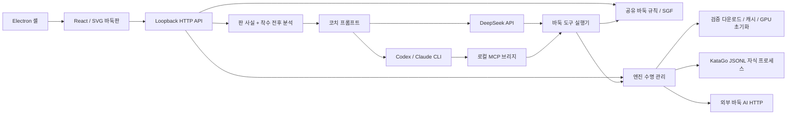

# 구조와 향후 계획

[English](../en/architecture.md) · [简体中文](../architecture.md) · [繁體中文](../zh-TW/architecture.md) · [日本語](../ja/architecture.md) · [한국어](architecture.md)

- `shared/`: 판 복원, 따내기, 합법성, SGF, 면적 계가, 상대 수 정책. UI·Node에 의존하지 않습니다.
- `server/`: 검증, 프로세스 수명, 요청 연결, 공급자, 근거 구성. 검색은 전체 수순을 받고 해설은 서버에서 얻은 엔진 결과를 사용합니다.
- `src/`: 훈련, 판, 본보 이동, 임시 주요 변화도, 대화. 대국·복기 수·시험 분기·대화를 별도 관리합니다. 대국·대화는 로컬 기록에 저장하고 대국·수 이동은 세션을 바꾸지 않습니다. localStorage는 옛 SGF 이전·백업과 언어·검색 설정에 사용합니다.
- `desktop/`: Node integration 끄기, context isolation / sandbox 켜기. 임의 `127.0.0.1` 포트에서만 수신하며 종료 시 KataGo를 해제합니다.
- `prompts/` / `skills/`: 하나의 코치 계약·시점을 공유합니다. UI 번역은 실행 중국어 프롬프트를 복제·대체하지 않습니다.

`src/useEvaluations.ts`는 현재 국면의 배경 분석과 요청한 그래프 완성을 직렬화하고 전면 작업·국면 변경 때 이전 요청을 취소합니다. 크기·규칙·덤·초기 돌·전체 수순 접두부·엔진별로 결과를 분리하고 새 기보는 초기화합니다. 기록에는 루트 승률·집 차이·visits·완료 상태만, 전체 후보·영역은 현재 요청만 보관합니다. 흑 관점 그대로 표시 승률만 ×100하며 집 차이 부호는 뒤집지 않습니다. 빠진 수는 연결하지 않고 미완료는 빈 원입니다.

`src/i18n.ts`와 5개 목록이 시스템 언어·선택 저장·재마운트 없는 갱신을 처리합니다. 알려진 서비스 알림은 렌더링 시 번역하고 사용자 내용·알 수 없는 진단은 유지합니다. 펼친 분석 패널은 그래프·후보 공간을 확보하고 현재 값은 제목, 탐색 통계는 분석 진행률 옆에 둡니다.

Markdown은 `react-markdown` / `remark-gfm`으로 누적 공개 본문을 렌더링하며 원시 HTML·원격 이미지를 허용하지 않습니다. 외부 링크는 HTTP(S)만 시스템 브라우저로 열며 모델 출력이 앱 페이지를 대체하거나 로컬 프로토콜을 실행하지 못합니다. 바둑 fragment는 [대화형 해설](coach-links.md)의 통제된 계약입니다.

## 엔진 관리

`EngineManager`는 비동기 설치·초기화를 하고 `/api/status`로 단계·진행·PID를 제공합니다. 시작·중지·재시작·전환은 직렬이며 중지는 다운로드·초기화를 취소하고 기존 자식 종료 후 새 프로세스를 시작합니다. KataGo는 `shell:false`, `detached:false`, stdin 파이프를 사용합니다. 종료 훅·EOF로 정리하며 정상 종료는 최대 2초 뒤 강제 종료합니다. 소스는 `.local/katago`, 데스크톱은 userData입니다.

manifest는 버전·SHA-256을 고정하고 임시 파일 검증 후 이름을 바꾸며 잠금·staging으로 설치합니다. 매 시작마다 로컬 파일을 확인합니다. 외부 AI도 `AnalysisEngine`과 흑 시점을 공유하고 연결은 `connection.json`에 저장합니다. [엔진](engines.md)을 참고하세요.

## 스트리밍 프로토콜

`POST /api/analyze` / `/api/coach`는 `Accept: application/x-ndjson`에서 줄별 `status`, `analysis`(before/after, `final`로 중간 구분), `tool`(ID별 실행·진행), `text`(누적 공개 답), `done` / `error`를 보냅니다. 코치 예산 도달 시 `paused`도 보냅니다. Accept가 없으면 JSON 응답을 유지합니다.

KataGo `reportDuringSearchEvery`의 중간값은 실시간 표시용이고 최종 결과만 해설 근거로 사용합니다. DeepSeek는 SSE, Claude는 `stream_event`의 `text_delta`, Codex는 `item.*`의 `agent_message`를 읽으며 Codex 최종 본문은 출력 파일이 기준입니다. 비공개 추론은 메시지에 넣지 않습니다. 연결 종료는 AbortSignal로 전파하고 오류·미완료 스트림을 성공으로 취급하지 않습니다.

## 코치 에이전트

`server/coach-tools.ts`는 `inspect_position`, `analyze_variation`, `query_game_history`, `edit_trial`을 제공합니다. 기록은 페이지별 목록, ID별 기보, 수별 국면과 원래 수·시험 상태를 반환합니다. 해설마다 기보 스냅샷을 고정하고 현재 또는 마지막 수 직전에서 `shared/`로 수순을 복원·검증해 같은 엔진에 질의합니다. 판·돌 무리·활로·흑 관점 분석·후보 변화를 반환하며 tool 이벤트는 대화에 들어가고 본보 그래프에는 들어가지 않습니다. 전체 결과는 근거 내보내기에 포함하고 편집은 [분기 계약](coach-links.md)을 따릅니다.

시간·도구·누적 visits는 기본 무제한이며 개별 설정합니다. 한 검색은 50–4,000 visits, 기본 800입니다. 같은 시작·수순·visits는 해설 내 캐시를 재사용합니다. 호출은 직렬이고 오류는 모델에 반환해 수정하게 합니다. 취소는 대기열·엔진·LLM까지 전파합니다. 저장 시간 제한은 `LLM_TIMEOUT_MS`(기본 0)보다 우선합니다.

`server/deepseek.ts`는 스트리밍 도구 인수를 조립하고 실행·결과 전달을 반복하며 다른 공급자와 같은 예산을 사용합니다. 상한에서 일시 중지하고 사용자가 계속할 수 있습니다. `reasoning_content`는 서버에만 남고 같은 해설을 이어 가는 공급자에게만 반환합니다.

CLI는 `server/coach-mcp.ts`의 임시 Streamable HTTP MCP를 사용합니다. 임의 loopback 포트·요청별 token·Host/Origin 검증을 쓰며 token은 자식 환경으로 전달합니다. 인수로 MCP, 바둑 도구와 [LLM 설정](llm.md)의 웹 도구를 허용합니다. CLI 종료 시 MCP·미완료 검색을 닫고 실행기 콜백·CLI 이벤트로 UI를 갱신합니다. 사용자 전역 hook·MCP 설정은 바꾸지 않습니다.

## 기록 저장

`server/library.ts`는 대국·세션별 UUID를 갖는 로컬 JSON 문서 DB입니다. 임시 파일의 원자적 이름 변경 뒤 메모리 색인을 갱신합니다. `GET /api/library`로 읽고 `POST /api/library/games` / `/api/library/conversations`로 저장합니다. schema·공유 규칙으로 검증하고 손상 파일은 명시 오류를 냅니다. 기본은 `userData/history` / `.local/history`, 변경은 `GO_TRAINER_HISTORY_DIR`입니다.

`src/useLibrary.ts`는 저장을 직렬화하고 같은 레코드의 대기 갱신을 합칩니다. 실패 시 미기록 항목을 남겨 재시도를 표시하고 읽기 실패로 빈 기록을 덮어쓰지 않습니다. 대화마다 불변 문맥을 저장하며 서버는 '저장 기보 접두부 + 시험 수순' 일치를 확인한 뒤 코치에게 전달합니다. 본보는 실전 수만 추가하고 가져오기·새 대국·시험 저장은 새 ID를 만듭니다. `shared/trial.ts`는 공유 규칙으로 살아 있는 시험 돌을 추적하고 따낸 돌 표식을 제거합니다.

## 데이터와 권한

개발은 Vite 5173·로컬 API 3001만 엽니다. Host·Origin·JSON·앱 헤더를 검증하며 공개 CORS나 임의 실행·파일 읽기 API는 없습니다. CLI는 인수 배열로 시작하고 기보·질문은 stdin으로만 전달합니다. 키는 서버 비공개 설정·env에 저장하고 응답에 반환하지 않으며 API 캐시를 끕니다. 단일 사용자 로컬 서비스로 공개 멀티테넌트 서비스가 아닙니다.

`server/llm-settings.ts`는 인증 확인·기본 선택·원자 저장을 맡고 UI는 비밀 제거 설정만 받습니다. 키는 localStorage에 넣지 않습니다. 각 요청은 공급자·설정 스냅샷을 고정하며 후속 수정은 다음 요청에 적용합니다. 모델·추론·선호를 저장하고 변경은 30초 감지 캐시를 무효화합니다.

SGF 가져오기는 업로드하지 않습니다. 질문할 때만 판·짧은 기록·후보·대화를 LLM에 보냅니다. 문맥에는 제목·ID·원래 수·시험 수순이 들어가고 기록 도구는 메타데이터·착수를 읽을 수 있습니다. CLI 공급자도 계정 정책에 따라 요청을 보관할 수 있습니다. 로컬 CLI는 오프라인 모델이 아닙니다.

## 현재 제약과 향후 계획

수별 복기·해설과 전체 엔진 그래프는 가능하지만 전 기보 자동 LLM 해설은 없습니다. SGF는 파일마다 하나의 기록 항목으로 모든 변화·주석·표시를 보존하고, 트리에서 선택한 국면을 메인 바둑판에 열 수 있습니다. 수동·AI는 공통 추가 로직을 쓰며 본보 끝은 실전, 과거·기존 시험은 분기로 이어갑니다. 시험 삭제·새 대국 저장·과거 국면 분기가 가능하고 PV 미리 보기는 실전을 바꾸지 않습니다.

계가는 사석 수동 표시 후 중국식 면적 미리 보기입니다. `chinese-ogs`의 위치 동형 반복 금지와 접바둑 보정 N을 사용합니다. 일본 정식 계가, 빅 판정, 복잡한 순환 무승부는 미완료입니다. 야호·절예 Elo 보정은 없으며 공격성은 접촉 선호의 근사치입니다.

1. 교육: 고정 근거 데이터, 사람의 블라인드 평가, 실전 착수 강제 탐색, 주요 변화도 재검증, 좌표 상호작용 개선.
2. 복기: 모델/규칙/덤/기록/profile/visits별 영구 캐시, 세밀한 우선순위, 손실 집 수·중요 수 색인.
3. 기보: 전체 분기 편집, 주석·표식, 기보 모음, 플랫폼 어댑터.
4. 대국: 시계, 불계, 급단·접바둑 보정, 실전 기반 기풍 지표.
5. 배포: 기존 오프라인·서명·업데이트의 실기기 검증 확대, 시스템 키체인, 업데이트 롤백.
