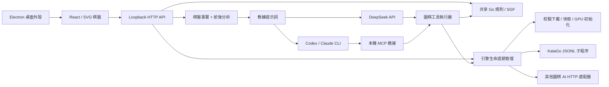

# 架構與後續路線

[English](../en/architecture.md) · [简体中文](../architecture.md) · [繁體中文](architecture.md) · [日本語](../ja/architecture.md) · [한국어](../ko/architecture.md)

- `shared/`：棋盤重建、提子、禁著、SGF、面積計分及對手策略；不依賴 UI 或 Node。
- `server/`：參數校驗、程序生命週期、分析請求關聯、LLM provider 及證據構造。分析請求帶完整歷史，講解使用服務端取得的引擎結果。
- `src/`：訓練設定、棋盤、主線導航、臨時 PV 試讀、聊天；棋局、復盤手數、試下分支、對話會話分別管理。棋局和對話通過本地歷史庫保存，切換棋局或手數不改變會話；localStorage 用於遷移舊棋譜、備份當前棋譜以及語言和搜索偏好。
- `desktop/`：關閉 renderer Node 集成，開啟 context isolation / sandbox。後端僅監聽 `127.0.0.1` 隨機端口，退出時釋放 KataGo。
- `prompts/` 與 `skills/`：共用講棋契約；不重復維護不同的推理視角。

`src/useEvaluations.ts` 串行調度當前局面的後台分析及使用者發起的曲線補全，前台任務開始或局面變化時取消舊請求。臨時歷史按棋盤大小、規則、貼目、初始擺子與完整落子前綴關聯，並隔離引擎實例；新棋譜顯式清空。只保存每手根節點勝率、目差、visits 和完成狀態，完整候選/歸屬資料只保留當前查詢。數值直接使用黑方視角；曲線僅在繪制百分比時將勝率乘 100，目差不反號。缺失手數不連線，未完成結果保留空心點。

Markdown 使用 `react-markdown` + `remark-gfm` 渲染累計公開正文，不啟用原始 HTML 或遠程圖片。外鏈只接受 HTTP(S)，桌面端交給系統瀏覽器，不允許模型輸出替換應用頁面或執行本地協議；受控的圍棋 fragment 連結見[交互講解](coach-links.md)。

`src/i18n.ts` 與五語言詞條負責系統語言解析、偏好持久化與不重掛載的介面更新。已知服務通知在渲染時翻譯，使用者內容與未知診斷保持原文。目差/勝率面板在展開時預留曲線和候選空間，當前數值放在標題行，搜索統計放在已分析進度處。

## 引擎管理

`EngineManager` 預設異步安裝並預熱 KataGo；介面通過 `/api/status` 讀取階段、下載進度和 PID。啟動、停止、重啟、切換按隊列串行執行；停止會中斷下載和預熱，等待舊子程序退出再啟動新程序。KataGo 使用 `shell:false` / `detached:false` / stdin 管道；退出鈎子和 stdin EOF 負責清理，正常關閉最多等待 2 秒後強制結束子程序。源碼資料位於 `.local/katago`，桌面歸檔資料位於 userData。

下載清單固定版本和 SHA-256；臨時檔案校驗後重命名，安裝有程序鎖和 staging 目錄。每次啟動復核本地檔案。外部適配器與 KataGo 共用 `AnalysisEngine`，返回統一黑方視角；連接方式寫入快取目錄的 `connection.json`。詳見 [介面與部署](engines.md)。

## 流式協議

`POST /api/analyze` 與 `POST /api/coach` 在 `Accept: application/x-ndjson` 下返回按行 JSON：`status`、`analysis`（before/after，final 區分中間搜索結果）、`tool`（按 ID 更新執行狀態與搜索進度）、`text`（累計公開回答）、`done` 或 `error`，教練達到預算時可返回 `paused`。不指定該 Accept 時保留 JSON 響應。

KataGo 開啟 `reportDuringSearchEvery`，搜索中的數值只用於即時顯示，最終分析才進入講解證據。DeepSeek 解析 SSE；Claude 解析 `stream_event` 的 `text_delta`；Codex 解析 `item.*` 的 `agent_message`，最終文本以輸出檔案為準。推理私有內容不進入消息。連接關閉通過 AbortSignal 取消上游；錯誤和不完整資料流不會被當成成功結果。

## 講棋 Agent

`server/coach-tools.ts` 提供 `inspect_position`、`analyze_variation`、`query_game_history` 和 `edit_trial`。歷史工具支援分頁列舉棋局、按 ID 讀取完整棋譜及指定手數局面，並返回當前原局手數和使用者試下狀態。每次講解固定棋譜快照；工具從當前局面或最後一手之前開始，使用 `shared/` 重建和校驗試下手順，再通過同一 `AnalysisEngine` 查詢。工具返回棋盤、重點棋塊與氣、黑方視角分析和候選變化；試下結果通過 `tool` 事件傳給對話，不進入主線曲線。完整工具結果隨“導出分析”一起導出。

單次講解的總用時、工具次數與累計搜索量預設無限制，可在 LLM 設定中分別啟用上限。每次搜索仍為 50–4,000 visits，預設 800。相同起點、手順與 visits 的查詢復用本次講解內的快取。調用串行執行，錯誤作為工具結果返回給模型修正；取消信號貫穿排隊、引擎搜索和 LLM。總時限優先使用 LLM 設定，未保存時使用 `LLM_TIMEOUT_MS`（預設 0，表示無限制）。

DeepSeek 由 `server/deepseek.ts` 驅動多輪調用：拼接流式工具參數、執行工具、回傳結果，和其他接入共用工具調用次數額度；達到設定的上限後會暫停並由使用者決定是否繼續。`reasoning_content` 僅在服務端回傳給供應商以延續同一次講解。

CLI 通過 `server/coach-mcp.ts` 的臨時 Streamable HTTP MCP 服務調用同一執行器。服務監聽隨機 loopback 端口，使用每次請求獨立的令牌，校驗 Host 與 Origin；令牌通過子程序環境傳遞。應用通過調用參數設定 MCP，授權這些圍棋工具及 [LLM 設定](llm.md) 中說明的供應商網頁工具。CLI 退出後關閉 MCP 服務和未完成搜索。執行器回調與 Codex/Claude 的工具事件共同更新 UI，無需修改使用者的全局 hook 或 MCP 設定。

## 歷史存儲

`server/library.ts` 是本地 JSON 文檔資料庫，每局棋和每個會話使用獨立 UUID；臨時檔案原子重命名後再更新記憶體索引。`GET /api/library` 讀取歷史，`POST /api/library/games` 和 `/api/library/conversations` 分別保存。棋譜保存前經 schema 和共享規則驗證，損壞的資料庫檔案會顯式報錯。桌面預設存放於 `userData/history`，Web 模式預設 `.local/history`，均可通過 `GO_TRAINER_HISTORY_DIR` 覆蓋。

`src/useLibrary.ts` 串行保存、合併排隊中的同一記錄更新，失敗時保留待寫記錄並顯示重試入口；讀取失敗時不會用空歷史覆蓋舊資料。每輪聊天保存不可變棋局上下文，服務端核對所傳局面等於「庫內原局前綴 + 試下手順」，再將上下文交給教練。棋局主線更新只追加實戰落子；導入、新局和試下另存均生成新 ID。`shared/trial.ts` 通過共享規則追蹤仍在棋盤上的試下棋子，提子後移除標記。

## 資料與權限

開發環境只開放 Vite 5173 與本地服務 3001；服務校驗 Host、Origin、JSON 與自訂應用請求頭。不開放 CORS、不提供任意命令執行或檔案讀取介面。CLI 用參數數組啟動，棋譜/問題只走 stdin。API key 可以從 UI 寫入服務端私有設定檔案，或使用環境預設值，任何響應都不回傳金鑰；API 響應禁用快取。該服務面向單使用者本機，不是多租戶公網服務。

`server/llm-settings.ts` 負責認證探測、預設服務選擇和原子保存。UI 只接收已脫敏的設定，金鑰不進入 localStorage。每次講棋請求固定服務與設定快照；之後修改設定影響下一次請求。模型、思考深度和服務偏好分別持久化，設定變更使 30 秒的認證探測快取失效。

棋譜導入不上傳。只有提問時，當前棋盤、短歷史、候選分析和當前對話才發到所選 LLM。本輪上下文包含棋局標題、ID、原局手數與試下手順；教練查詢歷史時可讀取該棋譜的元資料和落子。CLI 服務可能根據其賬號/供應商策略保存請求；不能把“本地 CLI”當成“離線模型”。

## 首版邊界

可以逐手查看和請求講解，並補全整局的引擎曲線；尚無整局 LLM 自動講解。SGF 首條主線導入，原注釋、分支不進入訓練記錄。主頁提供 AI 自動落子開關與 AI 執子選擇。手動和 AI 落子共用追加邏輯：主線末尾追加實戰落子，歷史處或已有試下時繼續試下分支，可清空或另存新棋局。歷史處的「分支新棋局」將當前局面另存為新局，之後正常落子。PV 僅作臨時試讀，不污染實戰。

數目是使用者標死子後的中國面積預覽，中國規則映射到 `chinese-ogs`（全局同形禁著），包含讓子還點 N；日本正式數目、雙活裁定、複雜循環無勝負未完成。難度沒有野狐/星陣 Elo 校准；激進度是近似接觸偏好。

## 迭代順序

1. 教學質量：固定證據資料集、人工盲評、實戰落點強制搜索、主要變化再分析；完善已有坐標高亮交互。
2. 復盤效率：持久化分析快取（模型/規則/貼目/歷史/profile/visits 聯合鍵）、更細的搜索優先級、逐手目損和關鍵手索引。
3. 棋譜編輯：完整變體樹編輯、保留注釋與標記、導入集合、平台樣例適配器。
4. 對戰：讀秒、認輸、穩定段位評測、讓子策略校准、基於實戰的棋風指標。
5. 發佈：擴展已有離線打包、簽名/公證與自動更新的實機驗證，支援系統鑰匙串和更新回滾。
